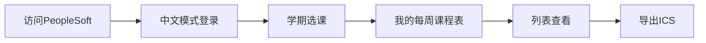

# 📅 PS Calendar to ICS (iZJU)

> 🎓 **专为浙江大学国际校区设计**  
> 将 PeopleSoft 课程表一键导出为标准 ICS 日历文件的 Tampermonkey 用户脚本

[](https://opensource.org/licenses/MIT)
[](./VERSION.md)
[](https://www.tampermonkey.net/)

---

## [点击加载油猴脚本](https://openuserjs.org/scripts/THEzsc/PS_Calendar_to_ICS_(iZJU))

## [博客地址](https://tzblog.tech/posts/工具-将izju的ps课表导出为ics文件并导入至日历/)

## ✨ 功能特点

### 🎯 核心功能
- 🏫 **iZJU专用适配** - 专为浙江大学国际校区PeopleSoft系统设计
- 🔍 **智能课程识别** - 基于真实HTML结构精确解析课程信息  
- 📝 **规范化命名** - 自动生成`CS 101 - 实验室 (LA1)`格式的清晰标识
- 🧩 **多组件支持** - 完美处理实验室、理论课、讨论课等不同组件
- 🌐 **中英双语** - 支持中英文混合的课程名称和时间格式

### 📅 智能行事历
- 🗓️ **2025-2026学年** - 内置完整的国际校区行事历数据
- 🚫 **假期自动跳过** - 中秋国庆、元旦等假期自动排除课程
- 🔄 **调休日处理** - 智能处理9月28日补课、10月11日补课等安排
- ⏸️ **停课日识别** - 校运动会、学生节等停课期间自动处理
- 🎉 **特殊事件** - 自动添加开学典礼、重要截止日期等提醒

### 🔧 技术特性
- ✅ **精确日期计算** - 基于RRULE+EXDATE机制，每个日期都经过验证
- 🧠 **智能状态管理** - 自动继承课程代码和组件信息
- 🌏 **时区标准化** - 使用Asia/Shanghai时区，确保时间准确无误
- 📱 **跨平台兼容** - 支持Outlook、Google Calendar、Apple Calendar等

## 🚀 快速开始

### 📥 安装步骤

#### 1️⃣ 安装 Tampermonkey
在您的浏览器中安装 [Tampermonkey 扩展](https://www.tampermonkey.net/)

#### 2️⃣ 安装脚本

> 🚀 **一键安装**: 通过 OpenUserJS 平台快速部署

| 步骤 | 操作说明 | 链接/说明 |
|------|----------|-----------|
| 1️⃣ | 安装浏览器扩展 | [Tampermonkey 官方下载](https://www.tampermonkey.net/) |
| 2️⃣ | 一键安装脚本 | [📥 OpenUserJS 安装链接](https://openuserjs.org/scripts/THEzsc/PS_Calendar_to_ICS_(ZJU)) |
| 3️⃣ | 开启开发者模式 | 🔧 **必需步骤** - 允许用户脚本运行 |
| 4️⃣ | 配置扩展权限 | 🛡️ 确保脚本可以正常工作 |

<details>
<summary>🔧 浏览器扩展管理页面</summary>

| 浏览器 | 管理页面链接 | 快捷键 |
|--------|-------------|--------|
| 🌐 **Google Chrome** | [`chrome://extensions/`](chrome://extensions/) | `Ctrl + Shift + Delete` |
| 🔷 **Microsoft Edge** | [`edge://extensions/`](edge://extensions/) | `Ctrl + Shift + Delete` |
| 🔴 **Opera** | [`opera://extensions`](opera://extensions) | `Ctrl + Shift + E` |

**⚠️ 重要配置**:
1. 打开 **开发者模式** 开关
2. 进入 Tampermonkey 设置
3. 启用 **"允许用户运行脚本"** (如有该选项)
</details>

---

### 📋 使用指南

#### 🔐 系统登录与导航



| 步骤 | 详细操作 | 注意事项 |
|------|----------|----------|
| 1️⃣ **系统登录** | 访问 [浙大选课系统](https://scrsprd.zju.edu.cn) | ⚠️ 右上角显示"English"时登录（中文模式）|
| 2️⃣ **进入课表** | 【学期选课】→【我的每周课程表】 | 📍 确保选择当前学期 |
| 3️⃣ **切换视图** | 点击【列表查看】按钮 | ❌ 不要使用"每周日历"视图 |
| 4️⃣ **导出课表** | 点击页面右上角"导出 ICS"按钮 | 📁 文件名格式: `iZJU-课程表-日期.ics` |
| 5️⃣ **导入日历** | 将 `.ics` 文件导入日历应用 | 📱 支持所有主流日历应用 |

#### 📱 支持的日历应用

<details>
<summary>🖥️ 桌面端应用</summary>

- ✅ **Microsoft Outlook** - Windows/Mac
- ✅ **Apple Calendar** - macOS
- ✅ **Thunderbird** - 跨平台
- ✅ **Notion Calendar** - 现代化界面
- ✅ **Google Calendar Web** - 浏览器端
</details>

<details>
<summary>📱 移动端应用</summary>

- ✅ **Google Calendar** - Android/iOS
- ✅ **Apple Calendar** - iOS
- ✅ **Outlook Mobile** - Android/iOS
- ✅ **Samsung Calendar** - Android
- ✅ **Any.do Calendar** - 跨平台
</details>

## 🧪 离线测试

> 💡 **开发者友好**: 支持本地HTML文件调试

```bash
1. 在 PeopleSoft 课表页面保存完整网页 (Ctrl+S)
2. 用浏览器打开保存的 HTML 文件  
3. "导出 ICS" 按钮同样可见并正常工作
4. 便于开发调试和功能验证
```

## 📊 支持的数据格式

<details>
<summary>🕐 时间格式支持</summary>

```
✅ 星期一 2:00PM - 3:50PM
✅ 周二 08:00 - 09:35  
✅ 一三五 13:00-14:35
✅ Monday 14:00-15:50
```
</details>

<details>
<summary>📅 日期格式支持</summary>

```
✅ 15/09/2025 - 21/09/2025  (DD/MM/YYYY)
✅ 09/15/2025 - 09/21/2025  (MM/DD/YYYY)  
✅ 2025-09-15 - 2025-09-21  (YYYY-MM-DD)
```
</details>

<details>
<summary>🗂️ 课程表结构识别</summary>

脚本智能识别包含以下信息的表格：
- ⏰ 日期和时间
- 📍 教室/地点  
- 👨‍🏫 讲师/教师
- 📆 开始/结束日期
- 🏷️ 课程代码和组件
</details>

## 🔧 故障排除

<details>
<summary>❓ 按钮不出现</summary>

- ✅ 确认处于 **"列表查看"** 模式，而非"每周日历"模式
- ✅ 确认页面包含课程表数据  
- ✅ 刷新页面重试
- ✅ 检查Tampermonkey是否已启用脚本
</details>

<details>
<summary>📭 导出的课程为空</summary>

- ✅ 检查是否有"TBA"或"待定"的课程时间
- ✅ 确认日期格式被正确识别
- ✅ 打开浏览器控制台 (F12) 查看错误信息
- ✅ 确认学期时间在2025-2026学年范围内
</details>

<details>
<summary>🏷️ 课程名称显示不正确</summary>

- 🔍 脚本自动查找 `td.PAGROUPDIVIDER` 中的课程名称
- 🔄 如果找不到，会显示为"课程 1"、"课程 2"等
- ✏️ 可以在导入日历后手动修改事件标题
- 📝 建议提交issue反馈具体的HTML结构
</details>

<details>
<summary>🌏 时区和时间问题</summary>

- ⏰ 脚本使用 **Asia/Shanghai** 时区 (UTC+8)
- 🔧 如需其他时区，可修改脚本中的 `TZID` 常量
- 📅 确认导入的日历应用时区设置正确
</details>

## ⚙️ 技术规格

| 项目 | 规格 | 说明 |
|------|------|------|
| 🌏 **时区** | Asia/Shanghai (UTC+8) | 无夏令时，适配中国标准时间 |
| 📅 **日期算法** | RRULE + EXDATE | RFC 5545标准，精确计算每个上课日期 |
| 🗓️ **行事历** | 2025-2026学年秋冬学期 | 内置完整的国际校区行事历 |
| 🔄 **补课处理** | 智能识别 | 自动标注补课日期和原因 |
| 🆔 **UID生成** | 哈希算法 | 基于课程信息的唯一标识符 |
| 📝 **文件编码** | UTF-8 | 完美支持中英文混合内容 |
| 📱 **兼容性** | 全平台 | 支持所有主流日历应用 |

---

## 📅 行事历支持

> 🎯 **2025-2026学年秋冬学期** 完整支持

### 📚 学期时间
```
🗓️ 开始: 2025年9月15日
🗓️ 结束: 2026年1月10日 (含考试期)
```

### 🚫 假期自动排除
| 日期 | 假期名称 | 处理方式 |
|------|----------|----------|
| 10月1-8日 | 中秋节、国庆节假期 | 🚫 自动跳过课程 |
| 10月24-26日 | 秋季校运动会 | ⏸️ 停课处理 |
| 1月1日 | 元旦假期 | 🚫 自动跳过课程 |
| 1月2-10日 | 期末考试周 | ⏸️ 停课处理 |

### 🔄 调休自动处理
| 调休日期 | 补课内容 | 标注 |
|----------|----------|------|
| 9月28日 | 补10月3日(周五)课程 | 🏷️ `(调课)` |
| 10月11日 | 补10月8日(周三)课程 | 🏷️ `(调课)` |

---

## 🤝 贡献

欢迎提交 Issue 和 Pull Request！

### 📋 贡献指南
- 🐛 **Bug报告**: 请提供详细的复现步骤和HTML结构
- 💡 **功能建议**: 欢迎提出新功能想法
- 🔧 **代码贡献**: 请遵循现有代码风格
- 📚 **文档改进**: 帮助完善使用说明

### 🏫 适配其他学校
如果您希望适配其他学校的PeopleSoft系统，欢迎Fork本项目！

---

## 📄 许可证

```
MIT License

Copyright (c) 2025 iZJU PS Calendar to ICS

Permission is hereby granted, free of charge, to any person obtaining a copy
of this software and associated documentation files (the "Software"), to deal
in the Software without restriction, including without limitation the rights
to use, copy, modify, merge, publish, distribute, sublicense, and/or sell
copies of the Software, and to permit persons to whom the Software is
furnished to do so, subject to the following conditions:

The above copyright notice and this permission notice shall be included in all
copies or substantial portions of the Software.

THE SOFTWARE IS PROVIDED "AS IS", WITHOUT WARRANTY OF ANY KIND, EXPRESS OR
IMPLIED, INCLUDING BUT NOT LIMITED TO THE WARRANTIES OF MERCHANTABILITY,
FITNESS FOR A PARTICULAR PURPOSE AND NONINFRINGEMENT. IN NO EVENT SHALL THE
AUTHORS OR COPYRIGHT HOLDERS BE LIABLE FOR ANY CLAIM, DAMAGES OR OTHER
LIABILITY, WHETHER IN AN ACTION OF CONTRACT, TORT OR OTHERWISE, ARISING FROM,
OUT OF OR IN CONNECTION WITH THE SOFTWARE OR THE USE OR OTHER DEALINGS IN THE
SOFTWARE.
```

---

<div align="center">

**🎓 Made with ❤️ for Zhejiang University International Campus**

[](https://github.com/THEzsc/Peoplesoft-Calendar-to-ICS)
[](https://www.tampermonkey.net/)

*让课程管理更简单，让学习生活更有序* ✨

</div>

`
